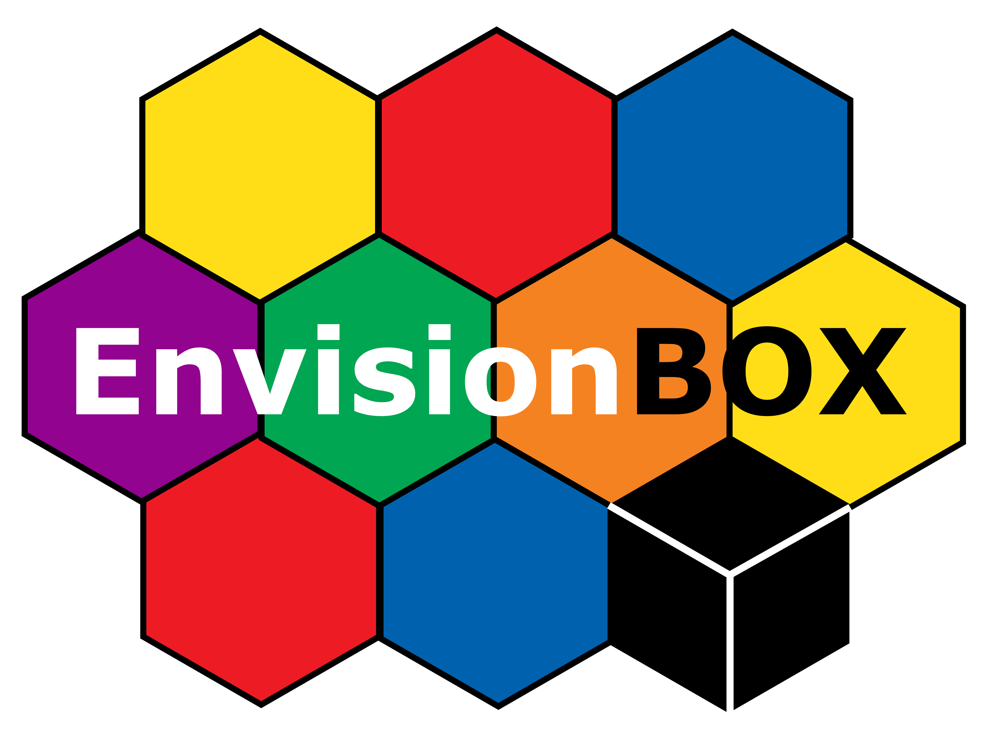
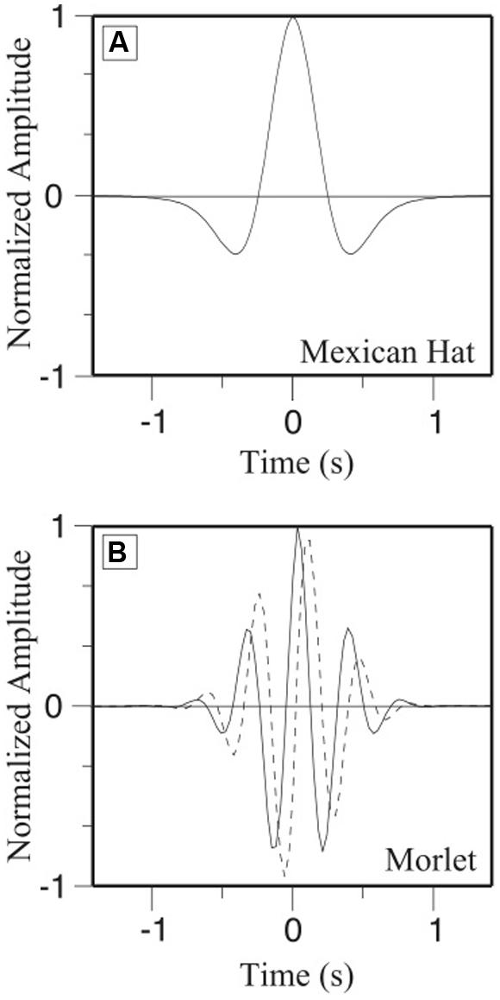

{ width=50%; align=”center”}

```{r setup, include=FALSE}
knitr::opts_chunk$set(echo = TRUE, warning = FALSE, message = FALSE)
library(ggplot2)
library(WaveletComp)
```
## Info documents

* This R coding module shows provides a basis for analyzing speech-gesture synchrony using a cross-wavelet approach. The approach builds on, and uses the end data frame from the MultimodalMerging module. Note that this is not meant to be a comprehensive theoretical discussion or in-depth guide on the underlying machinery of cross-wavelet analysis, but rather a starting point for understanding how to apply this methodology, how it differs from the peak analysis described in MultimodalMerging. For a more technical guide for wavelet approaches, see Issartel et al., 2006 ( https://doi.org/10.3200/JMBR.38.2.139-159) and Issartel et al., 2015 ( https://doi.org/10.3389/fpsyg.2014.01566 )

* location Repository:  https://github.com/WimPouw/envisionBOX_modulesWP/tree/main/CrossWavelet

* location Rmarkdown: https://github.com/WimPouw/envisionBOX_modulesWP/blob/main/CrossWavelet/CrossWavelet_SG_synchrony.Rmd

* citation: Trujillo, J.P. (`r Sys.Date()`). *Quantifying Speech-Gesture Synchrony Using Cross-Wavelet Analysis*. [the day you viewed the site]. Retrieved from: https://envisionbox.org/embedded_CrossWavelet_SG_synchrony.html


## Background

In studying multimodal human communication, the dynamical coupling between different modalities can be an important topic. It can allow us to better understand how different components of the multimodal communication system work together, and how this dynamical system develops and adapts to contextual demands. While peak-to-peak analysis has a strong foundation in the literature, it is limited to testing how two far apart two discrete time-points (i.e., the peak of kinematic motion and the peak of an auditory signal, such as intensity or pitch) are from one another. However, even when only considering the motion and acoustic time-series, there is more to speech and gesture than just their peaks. It can therefore be useful to also utilize methods that take more of the shape of these time-series into account when calculating synchrony. For this purpose, we consider the Cross-Wavelet Transform.

At the core of this analysis, is the notion of relative phase. That is, how similarly to one another two time-series are changing. If the two series are changing in the same direction, at the same time, yields a relative phase of 0 (i.e., in-phase). When the two are moving in opposite directions,  this is called anti-phase. Continuous Relative Phase (CRT) then provides a measure of synchronization at each time point.
{ align=”center”}

When studying living systems, such as multimodal communication, basic calculations of CRT can be difficult due to the fact that the time-series consist of several main frequency components. For example, an unfolding gesture may have a slow component related to the lifting of the arm, and a faster component related to twirling the hand around in a cyclic manner to depict a helicopter. These complex time-series are well-suited to cross-wavelet transform. 

The Wavelet Transform effectively uses a sliding window over a time-series, convolving the current window of the time-series with a wavelet (see below) of various frequencies. This allows us to capture the temporal properties of this window of the time-series. 
{width=50%; align=”center”}
Returning to the notion of relative phase, we move to the "cross" part of cross-wavelet analysis. Namely, cross-wavelet analysis provides a measure of the interaction between the two wavelet transforms (i.e., at each frequency/time-scale, and as a function of time). We therefore have a measure of not only how similar the two time-series are in their temporal development, but also at what frequency this is occurring.


## Practicalities
The minimum sampling rate is recommended as two times the highest frequency of the time-series. For example, average syllable duration is estimated at around 4Hz (0.25s), so we could take this, or a slightly higher value, as the highest frequency of interest. This means that sampling must be at least 4x2=8HZ.

The two time-series must also have the same length, and the same sampling rate. The alignment performed in the previous module is therefore a useful starting point for data preparation!


## Set up folders and check data formats

For this module we will only demonstrate the steps for the cartoon retelling example that we have in our multimedia samples. For this sample we have already generated A) a motion tracking time series for a bunch of body keypoints sampling at 30Hz, B) an amplitude envelope time series of speech which was sampled at 100Hz. C) Then we also have annotations of the dominant hand (right handed gestures) that this person produced. So here we show a way to merge A, B, and C, in a way that is convenient for further analysis. Lets first identify the relevant files and set the relevant folders.

```{r setting_up}
#When running this in Rmarkdown yourself: 
#first make sure to set "Session" -> "Set Working Directory" -> "To Source File Location"

#get current drive
curfolder <- getwd()
#Load in the motion tracking data
full_data <- read.csv(paste0(curfolder, "/data/mergedMM1.csv"))
#Load in the amplitude envelope
#This is the folder where your merged output is saved                                                 
outputfolder <- paste0(curfolder, "/output/")
```


# TODO: 
# INTRO, and adjust analysis
We must define a few parameters, most of which have been discussed above.
dt: time units. This is given as a fraction of a second
dj: this defines the resolution of the analysis. In other words, it will determine how finely the period scale between the upper and lower limits (described below) is divided, and thus how many frequencies within your defined range are being tested.
Upper/LowerPeriod: these parameters describe the theoretical upper and lower bounds for your analysis. In this example (and in related work) we use the average gesture stroke duration as an upper limit, for the slowest period of interest. If we were interested in the longer timecourse of a gesture, or multiple gestures, turn-taking, etc we would want to raise this value. For LowerPeriod, we ensure that the periodicity of speech syllables is captured. 
```{r Analysis, results=FALSE}
data <- full_data[!is.na(full_data$gesture_ID),]

gesture_ID <- unique(data$gesture_ID)
coher_syll <- vector()
pval_syll <- vector()
period_syll <- vector()
ID_syll <- vector()
coher_pitch <- vector()
pval_pitch <- vector()
period_pitch <-vector()
ID_pitch <- vector()
rphase_syll <- vector()
rphase_pitch <- vector()
# first we run the CWA and store all outcome measures
for (gesture in gesture_ID){
  CW_data <- data.frame(x = data[data$gesture_ID == gesture,]$speed,y =  data[data$gesture_ID == gesture,]$env)           #make an data.frame with the two relevant vectors
  CW_data <- CW_data[!is.na(CW_data$x),] 
  w.syll <- analyze.coherency(CW_data, 
                              loess.span = 0,                         #does the series need to be smoothed?
                              dt = 1/100,                             #what are time units (100Hz, i., 0.01 seconds)
                              dj = 1/100,                              #what is the resolution in the frequency domain that you want have? Here we set 0.01s (i.e., 1/50) 
                              lowerPeriod = 0.2,                    #the fastest period of interest we set at 8Hz (faster than the average syllable)
                              upperPeriod = 0.5,                      #the slowest period of interest we set at 2Hz (about the average length of a stroke)
                              make.pval = TRUE) 
  
  
  # for simplicity, we can take only the coherence values that are statistically reliable
  # note that for wavelet analysis, 0.1 is taken as the default alpha, rather than the more typical 0.05
  coher_select <- which(w.syll$Coherence.avg.pval < 0.1)
  if (length(coher_select) > 0){
    coher_syll <- append(coher_syll, w.syll$Coherence.avg[coher_select])
    pval_syll <- append(pval_syll, w.syll$Coherence.avg.pval[coher_select])
    period_syll <- append(period_syll, w.syll$Period[coher_select])
    row_phases <- rowMeans(w.syll$Angle,na.rm=TRUE) 
    rphase_syll <- append(rphase_syll, row_phases[coher_select])
    for (idx in 1:length(coher_select)) {
      ID_syll <- append(ID_syll, gesture)
    }
  }
}
syll_df <- data.frame(ID_syll, coher_syll, period_syll, pval_syll, rphase_syll)

saveRDS(syll_df, file="CW_syll.Rda")
```

We get quite a bit of useful information from the results, but let's focus on just a few. Specifically, Coherence, Period, and Phase.
We know Phase from the Introductory discussion. It's how closely temporally aligned the two time-series are, and in what direction. Coherence then (or cross-wavelet power) is how strong this association is. In other words, while phase tells you the time-lag of the correlation, coherence tells you the strength of the correlation. Period, then, indicates at what frequency this effect was found.

## Visualizing the Results
Let's take a look at the results to better understand what is happening. For this, we'll use one of the gestures where we know (from the previous results) that there is a significant relationship between speech and gesture. 
First, let's take a look at cross-wavelet power

```{r cross_power, results=FALSE}
gesture ="GID_6"

CW_data <- data.frame(x = data[data$gesture_ID == gesture,]$speed,y =  data[data$gesture_ID == gesture,]$env)           #make an data.frame with the two relevant vectors
CW_data <- CW_data[!is.na(CW_data$x),] 
w.6 <- analyze.coherency(CW_data, 
                            loess.span = 0,                         #does the series need to be smoothed?
                            dt = 1/100,                             #what are time units (100Hz, i., 0.01 seconds)
                            dj = 1/100,                              #what is the resolution in the frequency domain that you want have? Here we set 0.01s (i.e., 1/50) 
                            lowerPeriod = 0.2,                    #the fastest period of interest we set at 8Hz (faster than the average syllable)
                            upperPeriod = 0.5,                      #the slowest period of interest we set at 2Hz (about the average length of a stroke)
                            make.pval = TRUE) 


wt.image(w.6, color.key="quantile", n.levels=250,
         legend.params = list(lab="cross-wavelet power levels", mar=4.7))


```
In the plot, we have time along the x-axis, period in the y-axis, and power level denoted by the colorbar. The vibrant area framed in the middle represent significant values. Notice that the highest power occurs on a relatively high period (i.e., slow time-scale). Why might this be?


We can also visualize the individual power spectra to see how speech and gesture compare
```{r series_power}
wt.image(w.6, my.series="x")
wt.image(w.6, my.series="y")

```
Note here that the joint power plot above is mainly driven by the gesture time-series. This is why it can be most useful to look at the coherence.

```{r wavelet_coherence}
wc.image(w.6, which.image = "wc",
         color.key="interval", n.levels=250, 
         siglvl.contour=0.1, siglvl.arrow = 0.05,
         legend.params = list(lab="wavelet coherence", mar=4.7))

```
Here we see that the main significant areas of the spectrum are around the middle of the time-series (i.e., the mid-point of the gesture), and close in period to the estimated average stroke duration. The arrows indicate that the signals are in phase (facing rightward), with speech overall leading (facing downward).


## Discussion Points
- why do we see gesture following, rather than preceding speech? Several studies suggest that, at least for representational gesture, the gesture starts unfolding before the lexical affiliate, and velocity peaks occur closely before the acoustic peak.
- Is the gesture duration a good window for analysis? 

DIY: re-run these analyses using pitch peak and see how the results change!

## References
1. [Issartel, J., Bardainne, T., Gaillot, P., & Marin, L. (2015). The relevance of the cross-wavelet transform in the analysis of human interaction–a tutorial. Frontiers in psychology, 5, 1566.](https://doi.org/10.3389/fpsyg.2014.01566 )
2. [Rösch, A., & Schmidbauer, H. (2016). WaveletComp 1.1: A guided tour through the R package. URL: http://www. hsstat. com/projects/WaveletComp/WaveletComp_guided_tour. pdf.](http://www. hsstat. com/projects/WaveletComp/WaveletComp_guided_tour. pdf )
3. [Issartel, J., Marin, L., Gaillot, P., Bardainne, T., & Cadopi, M. (2006). A practical guide to time—frequency analysis in the study of human motor behavior: the contribution of wavelet transform. Journal of motor behavior, 38(2), 139-159.](https://doi.org/10.3200/JMBR.38.2.139-159 )